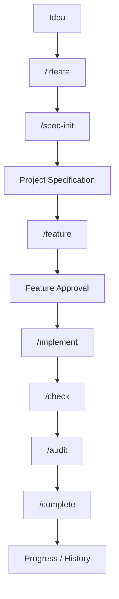

# Viker's BuildKit

**An AI development operating system for building software with coding agents.**

[](https://www.npmjs.com/package/vikers-buildkit)
[](https://github.com/vikersjunior/v-buildkit/actions/workflows/ci.yml)
[](https://opensource.org/licenses/MIT)

Viker's BuildKit is an installable development operating system that brings structure, spec-driven discipline, feature gating, security reviews, and capability management to AI coding agents.

---

## Quick Start

Run inside any new or existing project:

```bash
npx vikers-buildkit
```

Or use the short CLI alias:

```bash
npx v-buildkit
```

BuildKit automatically detects your project environment and active AI coding agents, prompts for confirmation, and installs the workflow system safely without modifying existing project files.

---

## What is Viker's BuildKit?

AI coding agents excel at writing code, but large software projects often suffer from:

- **Context Drift**: Agents losing sight of project goals over time.
- **Specification Decay**: Requirements abandoned once coding begins.
- **Feature Creep**: Unbounded changes without clear acceptance criteria.
- **Unverified Releases**: Lack of mandatory quality and security checks.
- **Vendor Lock-in**: Workflows tied to a single AI coding tool.

**Viker's BuildKit solves this by separating roles:**

```text
AI Coding Agent
    ↓
Does the coding & implementation

Viker's BuildKit
    ↓
Provides the development operating system around the agent
```

BuildKit introduces a spec-anchored lifecycle, a 70-skill inert capability catalog across 7 departments, feature-gated execution contracts, and multi-agent compatibility.

> 📖 **Learn how to get the most out of BuildKit** → Read the complete [Using Viker's BuildKit Effectively](docs/effective-usage.md) guide.

---

## The Development Lifecycle

BuildKit guides your AI coding agent through a structured lifecycle from concept to completed feature:



### Lifecycle Stages

- **`/ideate`**: Converge a vague idea into a crisp project scope.
- **`/spec-init`**: Generate the six core project specification files and match relevant tools from the capability catalog.
- **`/feature`**: Define a bounded implementation contract with acceptance criteria (no code edits allowed).
- **`/implement`**: Execute approved tasks following project rules and coding standards.
- **`/check`**: Verify implemented behavior against acceptance criteria.
- **`/audit`**: Enforce mandatory quality, architecture, accessibility, and security checks.
- **`/complete`**: Archive feature evidence and update project progress logs.

---

## Supported Agents

BuildKit integrates natively with all major AI coding tools:

| Agent | Integration Path | Detection Signals |
|---|---|---|
| **Claude Code** | `.claude/skills/` | `.claude/skills`, `CLAUDE.md`, `.claude/settings.json`, `claude` CLI |
| **Codex CLI** | `.agents/skills/` | `.agents/skills`, `AGENTS.md`, `codex` CLI |
| **Antigravity Agent** | `.agents/skills/` | `.agents/skills`, `AGENTS.md`, `antigravity` CLI |
| **Cursor** | `.cursor/skills/` | `.cursor/skills`, `.cursor`, `cursor-agent` CLI |
| **Gemini CLI** | `.gemini/skills/` | `.gemini/skills`, `.gemini`, `gemini` CLI |
| **GitHub Copilot** | `.github/skills/` | `.github/skills`, `.github/copilot-instructions.md`, `copilot` CLI |
| **Grok** | `.grok/skills/` | `.grok/skills`, `.grok`, `grok` CLI |
| **OpenCode** | `.opencode/skills/` | `.opencode/skills`, `.opencode`, `opencode` CLI |
| **Kiro** | `.kiro/skills/` | `.kiro/skills`, `.kiro`, `kiro` CLI |
| **Trae** | `.trae/skills/` | `.trae/skills`, `.trae`, `trae` CLI |
| **Rovo Dev** | `.rovodev/skills/` | `.rovodev/skills`, `.rovodev`, `rovodev` CLI |
| **Qoder** | `.qoder/skills/` | `.qoder/skills`, `.qoder`, `qoder` CLI |
| **Mistral Vibe** | `.vibe/skills/` | `.vibe/skills`, `.vibe`, `vibe` CLI |

---

## Installation Options

### Interactive Setup (Default)

```bash
npx vikers-buildkit
```

### Install in Specific Target Directory

```bash
npx vikers-buildkit install ./my-project
```

### Explicit Agent Selection

```bash
npx vikers-buildkit install . --agent claude
```

### Multi-Agent Installation

```bash
npx vikers-buildkit install . --agent claude,codex,cursor
```

### Linked Mode (`--link`)

Share one canonical `.buildkit/workflow-skills/` directory across multiple coding agents using relative symlinks (Unix) or directory junctions (Windows):

```bash
npx vikers-buildkit install . --agent claude,codex,cursor --link
```

### Scripted / Non-Interactive (CI)

```bash
npx vikers-buildkit install . --agent codex --no-detect
```

### Include Starter Specification Templates

```bash
npx vikers-buildkit install . --with-blank-templates
```

---

### Configurable Project Documentation Root

Specify where BuildKit-managed project documentation lives using `--docs-dir`:

```bash
npx vikers-buildkit install . --docs-dir docs/buildkit
```

Or configure it interactively during installation. BuildKit stores configuration in `.buildkit/config.json`:

```json
{
  "schemaVersion": 1,
  "docs": {
    "root": "docs/buildkit"
  }
}
```

---

## Project Structure & State Architecture

BuildKit separates human-facing project specifications from execution state:

```text
my-project/
├── docs/
│   └── buildkit/                 — Configurable Project Documentation Root (Source of Truth)
│       ├── PRD.md               — Product Requirements Document
│       ├── architecture.md     — System Architecture & Component Design
│       ├── Tech_stack.md       — Technology Stack & Promoted Capability Tools
│       ├── Implementation_plan.md — Execution Phases & Task Checklists
│       ├── rules.md            — Coding Guidelines & Security Guardrails
│       └── Progress.md         — Project Progress & Feature Audit Log
│
├── .buildkit/                     — BuildKit Execution & State Layer (Root)
│   ├── config.json               — BuildKit Project Configuration (docs.root)
│   ├── agent.md                  — Active Agent Configuration
│   ├── agent-capabilities.json   — Environment Capability Evidence
│   ├── workflow-skills/          — Canonical BuildKit Workflow Skills
│   ├── skills-library/           — 70-Skill Catalog (Inert until promoted)
│   ├── features/                 — Approved Feature Contracts
│   ├── history/                  — Execution History Logs
│   ├── audits/                   — Security & Quality Audit Reports
│   ├── decisions/                — Architectural Decision Records (ADRs)
│   └── rollbacks/                — Rollback Recovery Checkpoints
│
├── .claude/skills/               — Native Active Agent Skills Directory
└── src/                          — Project Application Source Code
```

---

## Agent Capability Signals

BuildKit records evidence about the project and local environment in `.buildkit/agent-capabilities.json`:

```json
{
  "schemaVersion": 1,
  "platform": "darwin",
  "node": "v20.11.0",
  "note": "Capabilities are evidence-based signals, not guarantees of vendor behavior.",
  "agents": [
    {
      "agent": "claude",
      "nativeSkills": true,
      "projectInstructions": true,
      "cliDetected": true,
      "shell": true,
      "git": true,
      "mcpEvidence": true,
      "parallelWorkEvidence": true
    }
  ]
}
```

Workflows use these signals to make safe decisions rather than assuming every coding agent behaves identically.

---

## Workflow Commands

Run these workflow skills directly inside your AI coding agent environment:

| Workflow Command | Purpose |
|---|---|
| **`/ideate`** | Explore and refine a vague product idea into a clear scope. |
| **`/spec-init`** | Generate the 6 core specification files and match capability skills. |
| **`/feature`** | Draft and approve a bounded implementation contract. |
| **`/implement`** | Execute an approved feature contract following project rules. |
| **`/check`** | Verify implementation against acceptance criteria. |
| **`/audit`** | Perform quality, architecture, accessibility, and security reviews. |
| **`/complete`** | Formally close a feature, record history, and log progress. |
| **`/progress`** | Read out current project progress and feature status. |
| **`/spec-review`** | Check specification files for internal drift. |
| **`/tools-check`** | Audit active capability skills against project requirements. |
| **`/distill-skill`** | Extract transferable project knowledge into a reusable agent skill. |

---

## Maintenance Commands

Manage, inspect, and update BuildKit installations via the CLI:

### Status

Check installation health, configured agents, symlinks, and specification files:

```bash
npx vikers-buildkit status
```

### Doctor

Run an automated diagnostic audit on BuildKit state and skill integrity:

```bash
npx vikers-buildkit doctor
```

*(Exits with status code `1` if health issues are found).*

### Update

Safely update workflow skills and capability libraries to the latest BuildKit version:

```bash
npx vikers-buildkit update
```

*BuildKit preserves all user specification files, custom user skills, and feature history during updates.*

### Repair

Restore broken symlinks/junctions or missing BuildKit files:

```bash
npx vikers-buildkit repair
```

---

## Safety & Non-Destructive Guarantees

BuildKit is designed to be safe for existing codebases:

1. **Non-Destructive Skill Copying**: BuildKit recursively merges workflow skills (`fs.cpSync`) instead of deleting directories. Custom user skills (e.g. `.claude/skills/my-custom-skill/`) are never removed.
2. **Template Preservation**: Starter templates (`--with-blank-templates`) will never overwrite existing specification files (`PRD.md`, etc.).
3. **Execution State Isolation**: Execution logs in `.buildkit/features/` and `.buildkit/history/` are strictly preserved across installations and updates.

---

## Workflow Example

### Adding a Feature with BuildKit

Instead of giving an agent a vague prompt like *"add payment checkout"*:

1. **Define Contract**: Run `/feature payment-checkout`. The agent drafts explicit acceptance criteria, security requirements, and file bounds in `.buildkit/features/payment-checkout.md`.
2. **Review & Approve**: Review the feature contract and give explicit approval.
3. **Implement**: Run `/implement payment-checkout`. The agent implements code within defined bounds.
4. **Verify & Audit**: Run `/check` to verify acceptance criteria, followed by `/audit` for security and code quality gates.
5. **Close & Archive**: Run `/complete`. BuildKit archives feature evidence to `.buildkit/history/` and updates `Progress.md`.

---

## Existing vs New Projects

- **Existing Projects**: Run `npx vikers-buildkit` in your existing codebase. BuildKit adds `.buildkit/` and native agent skills folders without touching your application source code.
- **New Projects**: Run `npx vikers-buildkit install . --with-blank-templates` to bootstrap blank specification starter templates alongside BuildKit workflows.

---

## Development & Contributing

To contribute to Viker's BuildKit:

```bash
git clone https://github.com/vikersjunior/v-buildkit.git
cd v-buildkit
npm install
npm test
```

### Running Tests

Execute the Node native test suite:

```bash
npm test
```

### Validating Package Artifact

```bash
npm pack --dry-run
```

---

## Releasing

Releases are published through GitHub Actions using npm Trusted Publishing (OIDC).

Pushing a version tag (e.g. `v2.4.1`) triggers:

1. Code checkout and Node.js setup
2. Automated test suite execution (`npm test`)
3. Provenance-backed npm publication (`npm publish --provenance`)

---

## License

Viker's BuildKit is licensed under the [MIT License](LICENSE).
